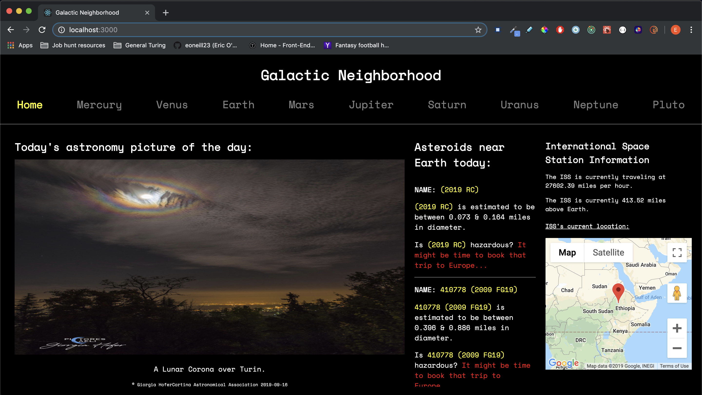
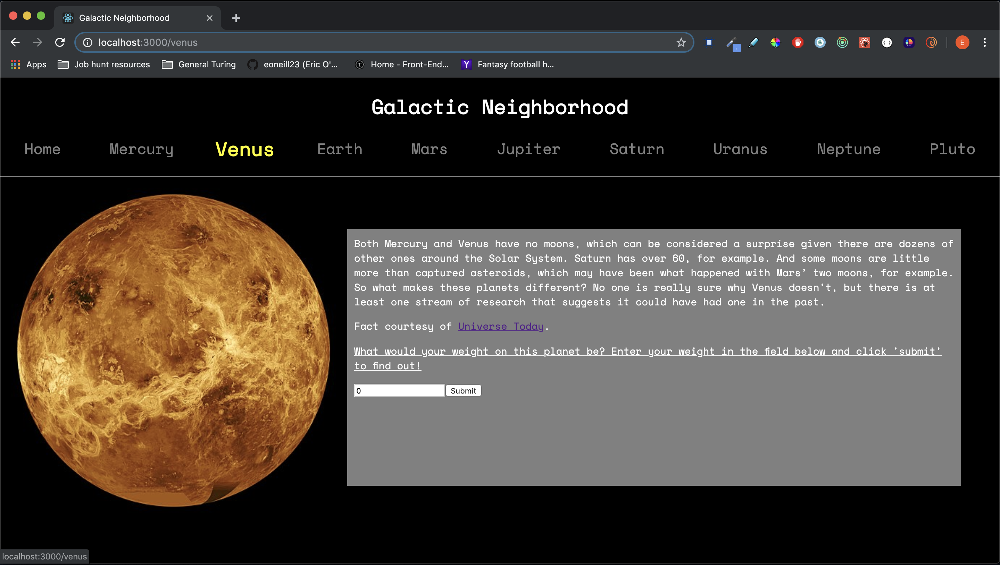

# Galactic Neighborhood

## Overview
Galactic Neighborhood is an app designed to provide information about our solar system as well as the International Space Station (ISS).

The home page includes NASA's astronomy picture of the day (APOD), asteroids near Earth, and the location of the ISS. Each individual planet page includes an image of the planet, a fun fact about the planet, and a form to calculate what the user's weight would be on the planet.

It was built as a six-day solo project.

## Built with
Galactic Neighborhood is built with:
* React (`create-react-app`)
* Redux
* React Router
* Functional React Components
* Class React Components
* [NASA API](https://api.nasa.gov/index.html)
* [Where is the ISS? API](https://wheretheiss.at/w/developer)
* [Google Maps API](https://cloud.google.com/maps-platform/)
* Fetch API
* Testing with Jest and Enzyme
* CSS

## Images

### Home page

### Planet page

### Planet page with weight calculation

